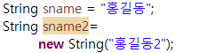

# 3. 변수와 자료형 
## (1) 자바의 자료형
#### 1) 기본형(Primitive Type) : JVM Runtime Area(Stack) 
- 정수형: byte(1), short(2), int(4), long(8) 
- 실수형: fload(4), double(8) 
- 논리형: boolean(1) 
> boolean은 true/false 값으로 나뉜다.
- 문자형: char(1) 
전부 소문자 이며, 괄호 안의 숫자는 메모리 데이터 이다.  

#### 2) 참조형(Reference Type) : JVA Runtime Area(Heap) 
- 배열(Array), 클래스(Class), 인터페이스(Interface) ...  

## (2) 변수 : 데이터를 저장하는 공간
#### 변수 선언 형식 : 자료형 변수명 = 데이터(값);
#### 변수명 정의시 유의사항
- 변수명은 알파벳(대소문자), 숫자, 특수문자(_,$), 한글 사용 가능 
- 숫자로 시작 불가 
- 공백 사용 불가 
- 대소문자 구분 
- 예약어(keyword: Java에서 사용되는 단어) 사용 불가 
- 변수명에 의미를 부여하는것이 좋음 

## (3) 상수: 항상 같은 값을 갖고 있는 변수
- PI, MAX_NUMBER 와 같이 상수는 모두 대문자로 작성 권장 

## (4) 변수 선언
- 정수형: int age = 10; int age; 
- 실수형: double aged = 10.1; 
- 논리형: boolean flag = true; 
- 문자형: char name = '홍'; 
> String type이 아니기 때문에 " "가 아닌 ' ' 사용 
> String은 기본형도 되고 참조형도 된다. 
 
아래 sname2 변수처럼 new 선언을 하면 참조형으로 인식해서 heap 영역에 메모리 주소 할당 됨 
stack 영역에는 sname2 변수에 heap 영역의 메모리 주소로 저장됨 
java 실행 엔진은 heap 영역을 참조하지 못하기 때문에 stack영역의 sname2를 참조하여 불러옴 

-라이브러리
import java.lang.String;
자주 사용하는 lang class 같은 것들은 자동으로 import 되어 있다.
lang을 제외한 다른 라이브러리는 import를 해야함